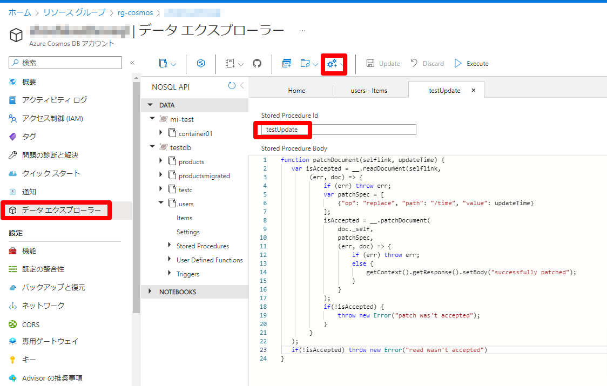
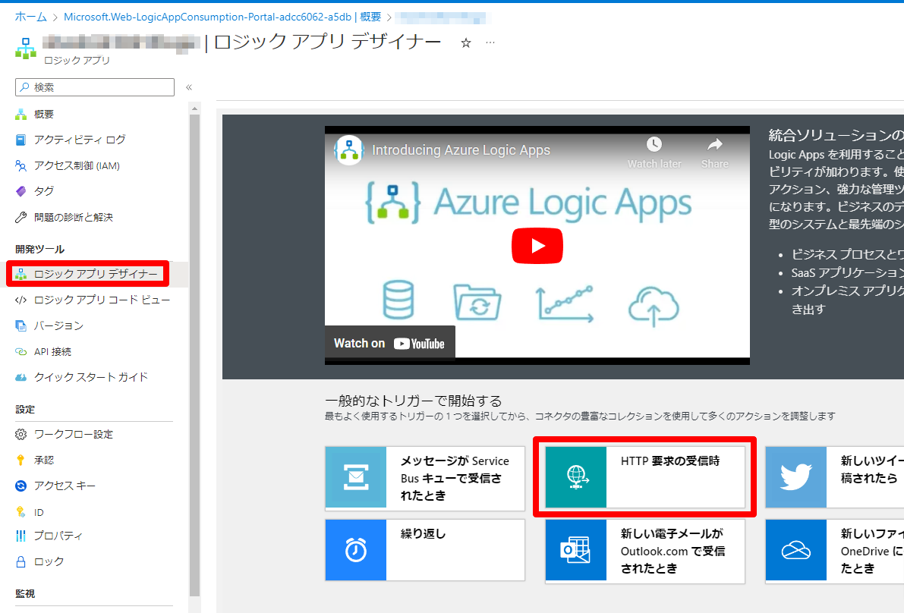
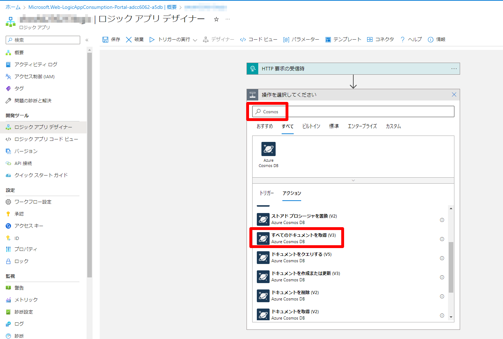
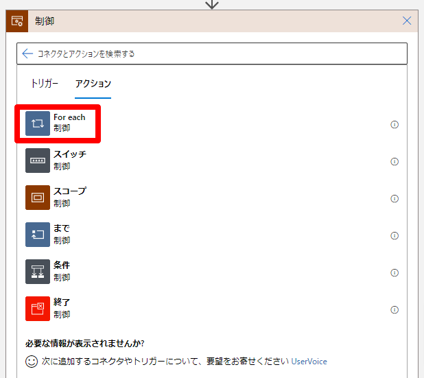
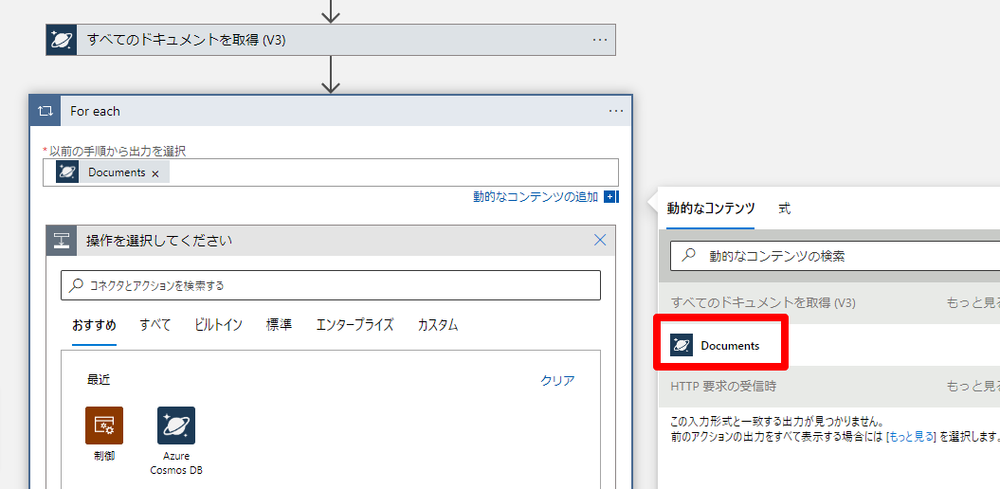
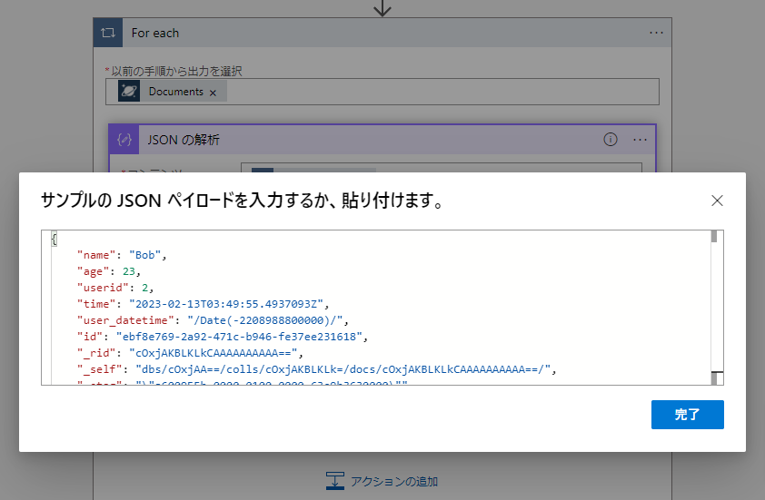
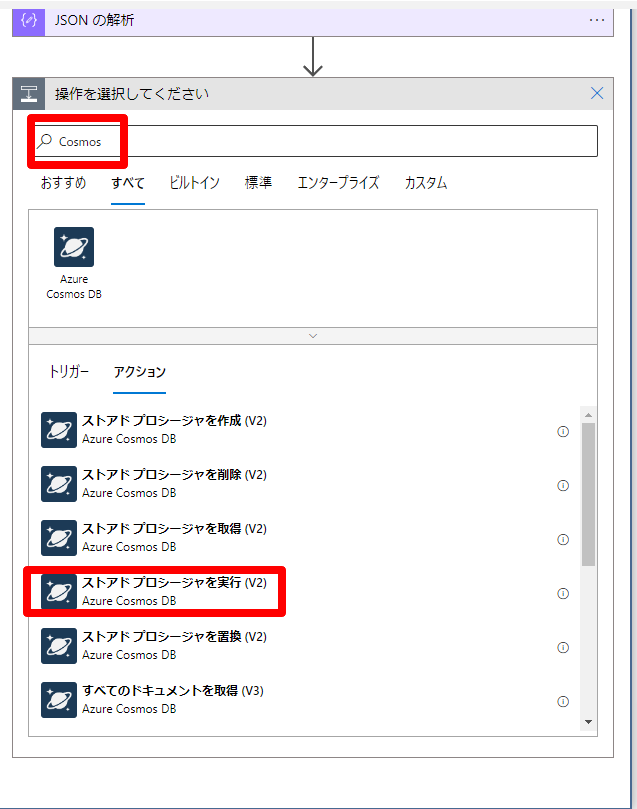
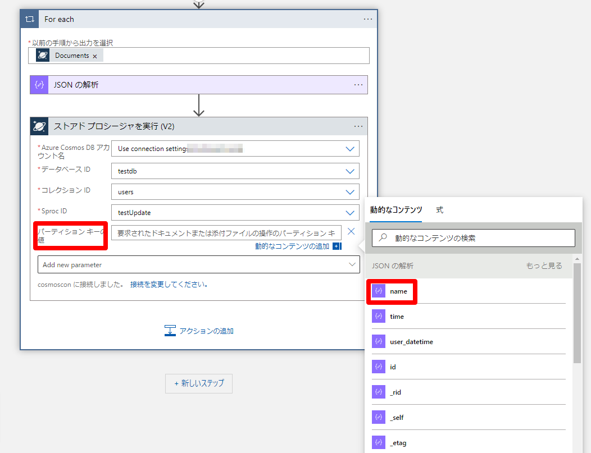
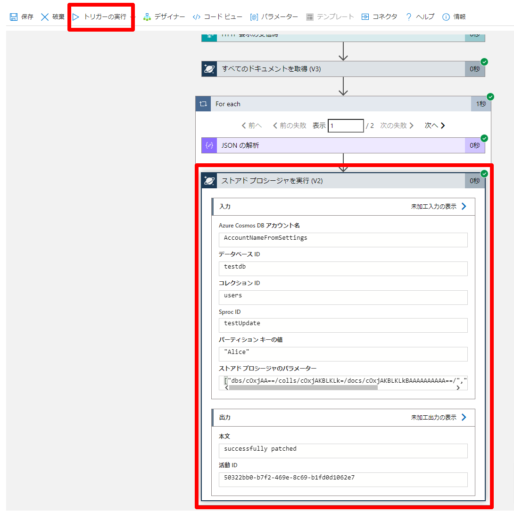
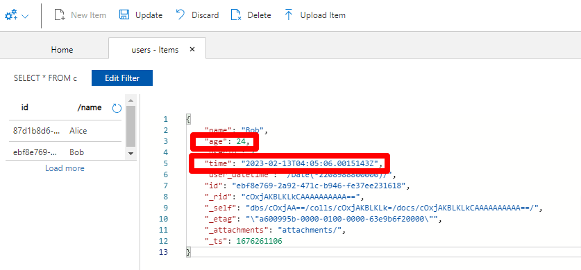

## 概要と背景

こんにちは、 Cosmos DB サポートチームの星井です。
この記事では、 Logic Apps の Cosmos DB トリガー機能と Cosmos DB NoSQL API側のストアド プロシージャを用いて、
ドキュメントを全件更新する方法をご案内いたします。
<!--more-->
Cosmos DB においては、 UPDATE 文を使ったデータの一括更新がサポートされていないため、このような場合、ドキュメントを全件取得して更新処理をかけていくことになります。
一方で Logic Apps では、 Cosmos DB のデータ全件取得処理とストアド プロシージャの実行がサポートされているため、これを利用してデータの一括更新を行うことが可能です。

今回の例では、 Cosmos DB NoSQL API のコレクション (コレクション ID: users) に以下の 2 ドキュメントが格納されているとします。パーティション キーは「name」です。
これらのドキュメントの「time」を現在時刻に更新し、かつ「age」に +1 をする処理を Logic Apps と Cosmos DB のストアド プロシージャを用いて実装してみます。

```
[
    {
        "name": "Alice",
        "age": 22,
        "userid": 1,
        "time": "2019-05-02 15:23:50.0000000"
    },
    {
        "name": "Bob",
        "age": 23,
        "userid": 2,
        "time": "2020-05-02 15:23:50.0000000"
    }
]
```

大まかに、以下の流れでシステムを構成していくことになります。

1. 部分的更新用のストアド プロシージャの登録
1. ロジック アプリ作成
1. ドキュメント全件取得ステップの追加
1. JSON の解析ステップの追加
1. ストアド プロシージャの実行ステップの追加
1. トリガーの実行


## 1. 部分的更新用のストアド プロシージャの登録

Cosmos DB のデータ エクスプローラーにて、部分的更新を行うストアド プロシージャを登録しておきます。この例では、ストアド プロシージャの ID は「testUpdate」としています。



ご参考：検証用のストアド プロシージャ：
```
function patchDocument(selflink, updateTime) {
   var isAccepted = __.readDocument(selflink,
        (err, res) => {
            if (err) throw err;
            var patchSpec = [
                {"op": "replace", "path": "/time", "value": updateTime},
                {"op": "replace", "path": "/age", "value": res.age + 1}
            ];
            isAccepted = __.patchDocument(
                res._self,
                patchSpec,
                (err, res) => {
                    if (err) throw err;
                    else {
                        getContext().getResponse().setBody("successfully patched");
                    }
                }
            );
            if(!isAccepted) {
                throw new Error("patch was't accepted");
            }
        }
   );
   if(!isAccepted) throw new Error("read wasn't accepted")
}
```

## 2. ロジック アプリ作成
Marketplace にて「Logic Apps」で検索し、ロジック アプリを選択して作成します。


今回は、プランの種類で「消費」を選択して確認および作成します。


「ロジック アプリ デザイナー」にて、今回は「HTTP 要求の受信時」を選択してロジック アプリを作成します。




## 3. ドキュメント全件取得ステップの追加
新しいステップを追加し、検索窓に「Cosmos」と入力し、アクションとして「すべてのドキュメントを取得（Ｖ３）」を選択します。




任意の接続名と、操作対象の Cosmos DB アカウント名、プライマリー キーの値を設定します。


Cosmos DB アカウント名、データベース ID、コレクション ID を入力し、新しいステップを追加します。


検索窓に「制御」を入力し、表示されたアクションから「For each」を選択します。




「以前の手順から出力を選択」の箇所で、動的なコンテンツとして「すべてのドキュメントを取得」から「Documents」を選択します。




## 4. JSON の解析ステップの追加
ストアド プロシージャに渡す値を各ドキュメントから取得するため、ドキュメント内の値をパースする必要があります。
こちら、「JSON の解析」アクションで実施します。
「アクションの追加」をクリック後、検索窓に「JSON」を入力し、「ビルトイン」タブから「JSON の解析」を選択します。


コンテンツに動的なアイテムの追加より「現在のアイテム」を指定します。
「サンプルのペイロードを使用してスキーマを生成する」をクリックし、以下のように Cosmos DB のデータ エクスプローラー等で表示できる、ドキュメントの値を入力し完了をクリックします。




## 5. ストアド プロシージャの実行ステップの追加
次に、ストアド プロシージャ実行のアクションを追加します。
検索窓に「Cosmos」を入力し、アクションとして「ストアド プロシージャを実行（V2）」を選択します。




Cosmos DB アカウント名、データベース ID、 コレクション ID、 ストアド プロシージャの ID を入力します。
新しいパラメーターの追加より「パーティション キーの値」を選択し、パーティション キーの値を指定します。この例のコレクションにおいては、パーティション キーは name なので、 「JSON の解析」から 「name」 を選択します。
「name」はダブルクォートで囲みます。




次に、新しいパラメーターの追加より「ストアド プロシージャのパラメーター」を選択します。
今回の例におけるストアド プロシージャの引数はドキュメントの ID、現在時刻の文字列になるので、
JSON の解析から「_self」、関数から 「utcNow()」を選択します。
今回のストアドプロシージャーのパラメーターは ["<_self>","<utcNow()>"]  と角括弧で全体を囲み、_self, utcNow() それぞれの引数の値はそれぞれダブルクォートで囲む必要がありますので、ご注意ください。


## 6. トリガーの実行
「トリガーの実行」をクリックすると、更新が実施され、結果が表示されます。



全ドキュメントが更新されているのを確認できます。


## まとめ

以上が、 Logic Apps と Cosmos DB のストアド プロシージャを用いて、データの一括更新を実装する方法です。
なお、Cosmos DB に対して一括更新処理を行うには、この記事の内容の他にも、[Cosmos DB SDK の Bulk サポート](https://learn.microsoft.com/ja-jp/azure/cosmos-db/nosql/how-to-migrate-from-bulk-executor-library)を用いる方法などがあります。


### 注意点
ドキュメントの一括更新にあたってはドキュメントの全件取得と更新処理を実施していくことになるため、処理の実施中はコレクションの RU 消費量が高まることが想定されます。そのため、運用環境へ導入される際は、性能試験を実施のうえ、十分なスループットをご準備ください。

参考記事：

* [Azure Cosmos DB におけるスループットのプロビジョニングの概要](https://learn.microsoft.com/ja-jp/azure/cosmos-db/set-throughput)
* [プロビジョニングされたスループット (RU/秒) のスケーリングに関するベスト プラクティス](https://learn.microsoft.com/ja-jp/azure/cosmos-db/scaling-provisioned-throughput-best-practices)


最後までお読みくださり、誠にありがとうございました。
この記事の内容が少しでも皆様のお役に立ちましたら幸いです。

ご不明な点がありましたら、 Azure ポータルよりいつでもお気軽にお問い合わせください！
