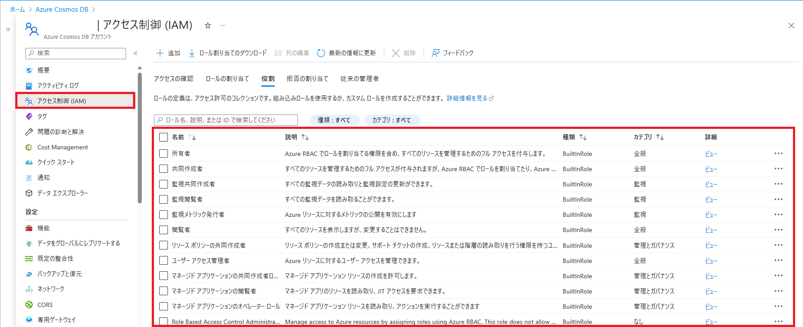
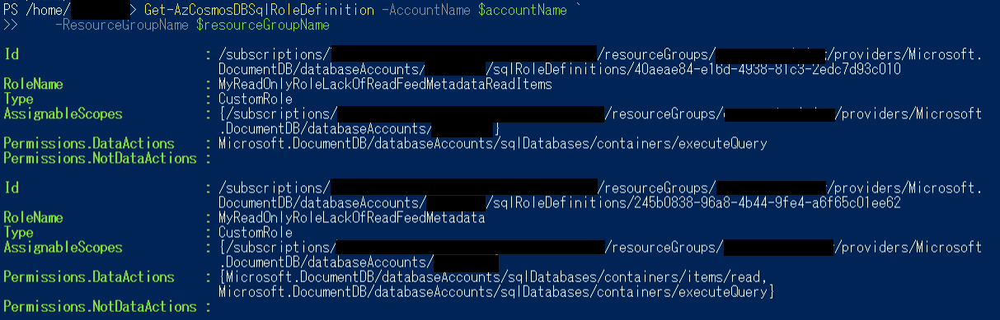
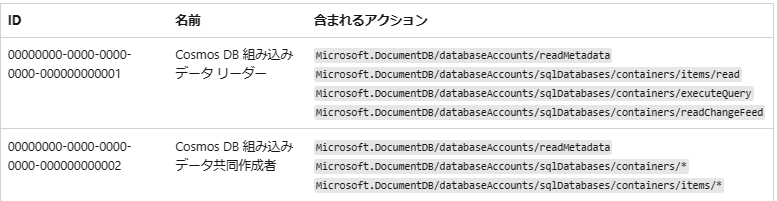
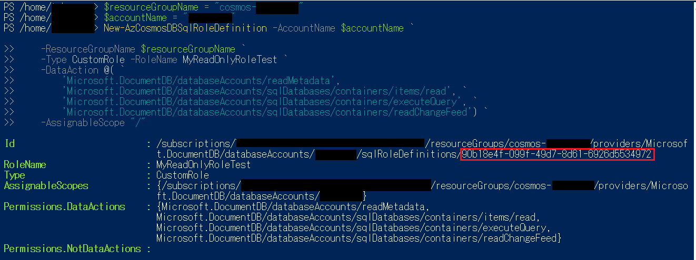
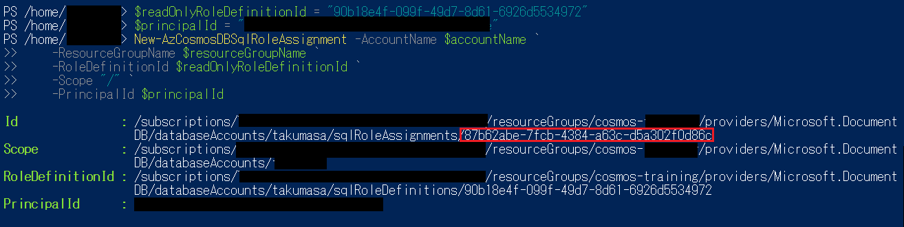
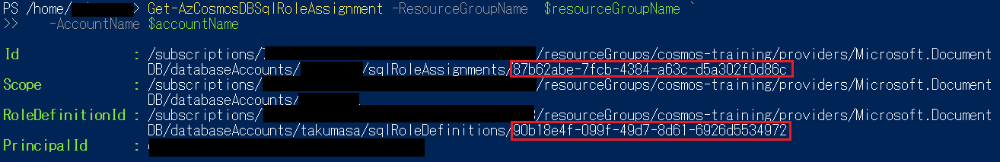

こんにちは。Cosmos DB サポートチームの松浦と申します。

本記事では Cosmos DB におけるロールベースのアクセス制御についての考え方をご案内します。
なお、本記事での、データに対する操作についての説明は NoSQL 用 API についての案内となります。

<!--more-->
## Cosmos DB における操作とロールベースの制御範囲の考え方

Cosmos DB に対する様々な操作は、データプレーンもしくは管理プレーン (コントロールプレーン) の操作に分けられます。
例えば、Cosmos DB に格納されているデータに対する読み取り、追加、削除、更新といったアクセスはデータプレーンでの操作となります。

一方で、Cosmos DB に格納されているデータに対する読み取り、追加、削除、更新といったアクセスはデータプレーンでの操作となります。

このうち管理プレーンでの操作は、Azure RBAC やキーを用いて操作可能です。
一方で、データプレーンに対する操作はキー、リソース トークン、Azure Cosmos DB RBAC を用いて操作することができます。

> [!WARNING]
> 間違いやすい点として、"Azure RBAC" と "Azure Cosmos DB RBAC" は確認方法やロールのアサイン方法が異なります。
> 例として、"Azure RBAC" はポータル画面から確認いただくことができますが "Azure Cosmos DB RBAC" はポータル上から確認することはできません。

そのため下記のスクリーンから確認できるロールは "Azure RBAC" に関するロールとなります。


"Azure Cosmos DB RBAC" のロールを確認する場合は、Powershell や CLI をご利用いただく必要がございます。

PowerShell を用いた "Azure Cosmos DB RBAC" のロール確認例



## アカウント管理操作に対する Azure RBAC によるアクセス制御

Azure RBAC にて、管理プレーンを経由する操作のアクセス制御を行う場合はポータル画面の アクセス制御 (IAM) ペインを使用することで割り当てを行うことができます。
ロールは、Active Directory 内のユーザー、グループ、サービス プリンシパル、およびマネージド ID に割り当てることができます。
詳細については下記の公開情報をご確認ください。
[ID およびアクセス管理 (IAM)](https://learn.microsoft.com/ja-jp/azure/cosmos-db/role-based-access-control#identity-and-access-management-iam)

> [!NOTE]
> Azure RBAC で、データプレーンに対する詳細な操作が制御できないのであれば、ポータルのデータ エクスプローラーから Cosmos DB のデータにアクセスを行う際は、どのような権限でアクセス管理がされているのか疑問に思う方もいらっしゃるかと思います。
> データ エクスプローラーを経由したデータへのアクセスは、キーを用いてアクセスが行われております。
> 具体的には、ポータルのデータ エクスプローラを使用するユーザーが、Microsoft.DocumentDB/databaseAccounts/listKeys/action や Microsoft.DocumentDB/databaseAccounts/readonlykeys/action の権限があるかを確認し、データプレーンへのアクセス可否が決定します。なお、この権限は、キーを用いる操作全般に影響するため、権限から取り除くと、管理プレーンに対する種々の操作にも制限が発生します。

## データ操作に対する Azure Cosmos DB RBAC によるアクセス制御
Cosmos DB のデータ操作を RBAC にてアクセス制御を行いたい場合は、Azure Cosmos DB RBAC を使用する必要があります。
Azure Cosmos DB RBAC は現在 (2023 年 7 月時点)、ポータル画面での管理を行うことができません。
そのため、PowerShell もしくは Azure CLI をご利用いただく必要があります。

なお、デフォルトのロールとして、読み込み専用のCosmosDB 組み込みデータ リーダー ロールと、書き込みを含めた Cosmos DB 組み込みデータ共同作成者ロールが用意されております。

組み込みロールに含まれるアクションの詳細につきましては下記の公開情報をご参考ください。

[組み込みロールの定義](https://learn.microsoft.com/ja-jp/azure/cosmos-db/how-to-setup-rbac#built-in-role-definitions)


> [!NOTE]
> 具体的にデータ操作に**含まれない**操作としては下記がございます。
> - データベースの作成、置換、削除
> - コンテナーの作成、置換、削除
> - コンテナー スループットの読み取り/置換
> - ストアド プロシージャの作成、置換、削除、読み取り
> - トリガーの作成、置換、削除、読み取り
> - ユーザー定義関数の作成、置換、削除、読み取り
> 上記の操作は Azure Cosmos DB RBAC では**扱われません。**

なお、データプレーンのロールの割り当て手順概要は下記となります。**すべての手順は Azure CLI もしくは PowerShell を使用する必要があります。**

*下記では PowerShell を使用しております。
1. データ管理要件に併せて、カスタム ロールを作成します。(既定のロールを利用する場合、この手順はスキップ可能です。)

```PowerShell
$resourceGroupName = "<myResourceGroup>"
$accountName = "<myCosmosAccount>"
New-AzCosmosDBSqlRoleDefinition -AccountName $accountName `
    -ResourceGroupName $resourceGroupName `
    -Type CustomRole -RoleName MyReadOnlyRole `
    -DataAction @( `
        'Microsoft.DocumentDB/databaseAccounts/readMetadata',
        'Microsoft.DocumentDB/databaseAccounts/sqlDatabases/containers/items/read', `
        'Microsoft.DocumentDB/databaseAccounts/sqlDatabases/containers/executeQuery', `
        'Microsoft.DocumentDB/databaseAccounts/sqlDatabases/containers/readChangeFeed') `
    -AssignableScope "/"
```
(実行例)


1. ロールをプリンシパル ID に割り当てます。
```PowerShell
$resourceGroupName = "<myResourceGroup>"
$accountName = "<myCosmosAccount>"
$readOnlyRoleDefinitionId = "<roleDefinitionId>" 
# For Service Principals make sure to use the Object ID as found in the Enterprise applications section of the Azure Active Directory portal blade.
$principalId = "<aadPrincipalId>"
New-AzCosmosDBSqlRoleAssignment -AccountName $accountName `
    -ResourceGroupName $resourceGroupName `
    -RoleDefinitionId $readOnlyRoleDefinitionId `
    -Scope "/" `
    -PrincipalId $principalId
```
(実行例)


1. ロールが割り当てられていることが確認できます。 
```PowerShell
$resourceGroupName = "<myResourceGroup>"
$accountName = "<myCosmosAccount>"
Get-AzCosmosDBSqlRoleAssignment -ResourceGroupName  $resourceGroupName `
   -AccountName $accountName
```
(実行例)



## まとめ

最後までお読みいただきありがとうございました。この記事では Cosmos DB for NoSQL のロールベースのアクセス制御についてご案内させていただきました。
Cosmos DB でのロールベース制御のご参考になりましたら幸いです。
ご不明な点がございましたら、お気軽に上記サポート窓口までお問い合わせください。よろしくお願いいたします。
